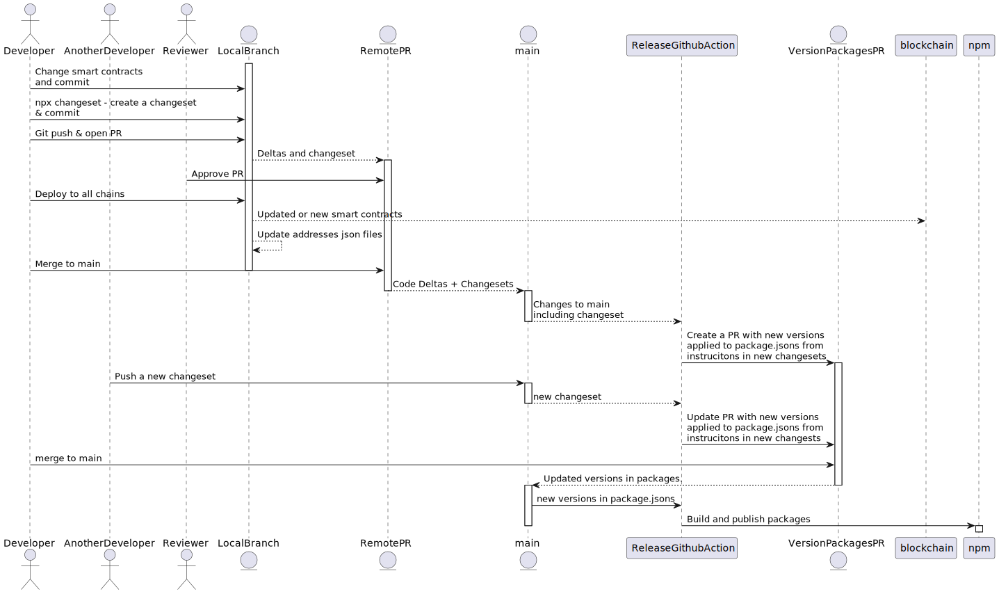

# Developer Workflow

## Deploying to a new chain

1. Setup new `chainConfigs` file setting 1. fee recipient, and 2. owner for factory contracts
2. Generate signatures for deploying upgrade gate at a deterministic address and trasfering ownership to the factory owner:

    npx tsx script/signDeploymentTransactions.ts

3. Deploy upgrade gate and implementation contracts:

    forge script script/DeployMintersAndImplementations.s.sol  $(chains {CHAINNAME} --deploy) --interactives 1 --broadcast --verify

4. Copy deployed addresses to `addresses/{CHAINID}.json`:

    npx tsx script/copy-deployed-contracts.ts

5. Generate signatures to deploy proxy contracts at determinstic address:

    npx tsx script/signDeploymentTransactions.ts

6. Deploy proxy contracts:

    forge script script/DeployProxiesToNewChain.s.sol  $(chains {CHAINNAME} --deploy) --interactives 1 --broadcast --verify

7. Ensure contracts are verified on block explorer.
8. Add a changeset with `npx changeset`
9. Make PR with new addresses json files and changeset.

# Whats bundled in the published package

* `/package/wagmiGenerated.ts` - smart contract abis and deployment addresses
* `./package/chainConfigs.ts` - configuration of smart contracts by chainId

# Publishing the package; Generating changesets, versioning, building and Publishing.

Diagram of the deploying + publishing workflow:

Publishing happens in the following steps:

* Some changes are made to the repo; this can include smart contract changes or additions, if smart contracts are changed, tests should be created or updated to reflect the changes.
* The changes are committed to a branch which is **pushed** to **github**.
* A **pr** is **opened** for this branch.
* The changes are reviewed, if they are **approved**:
* *If there are changes to the smart contracts that should be deployed*: the contract should be. Deploying the contract results in the addresses of the deployed contracts being updated in the corresponding `./addresses/{chainId}.json` file. This file should be committed and pushed to github.
* Running the command `npx changeset` will generate **a new changeset** in the `./changesets` directory. This changeset will be used to determine the next version of the bundled packages; this commit should then be pushed.
* The changeset and smart contract addresses are pushed to the branch.
* The pr is merged into main - any changesets in the PR are detected by a github action `release`, which will then **open a new PR** with proper the versions and readme updated in each each package.   If more changesets are pushed to main before this branch is merged, the PR will continuously update the version of the packages according to the changeset specifiction.

7. That version is merged into main along with the new versions.

8. The package is the published to npm with the command: `yarn publish-packages` and the package is published.

In a future version, the when the version branch is merged into main, it can publish the new repos to github.

Some active questions:

* How do we ensure the contract version matches the package version?  Or does it need to match?  Sometimes there is a js package update without a smart contract update.

Future ideas:

* Allow deployment to happen via github actions:
* Deployments can be added to changesets through some command.  If a changeset is pushed to main and a deployment is detected in it, a deployment task is added to the PR that's created.  When that PR is merged, the deployment happens, and a new package is built and publised to npm with the new versions.