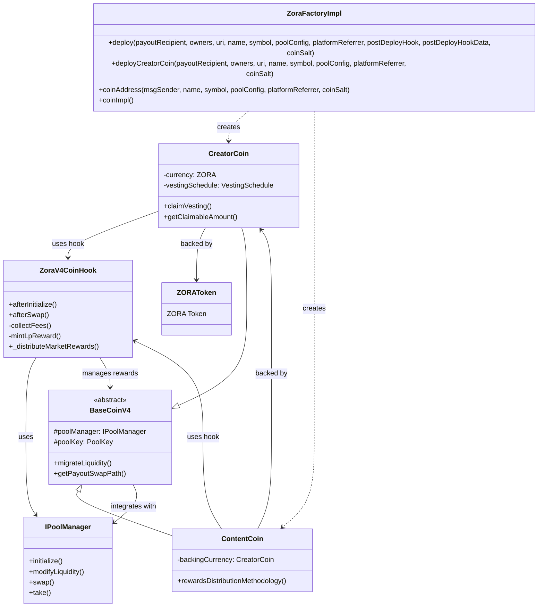

# Contract Architecture

This page provides a technical overview of how the Coins protocol contracts work together to enable coin creation, trading, and automatic reward distribution.

## Architecture Overview

*Visual overview of how contracts work together in the Zora Coins system*

## Core Components

### Coins Contracts

**BaseCoinV4 (Abstract)**
- Base implementation for both coin types
- Integrates with Uniswap V4 PoolManager
- Handles liquidity migration between hook versions
- Manages pool key and basic coin functionality

**CreatorCoin**
- One per creator, backed by ZORA tokens
- 1 billion total supply with 5-year vesting schedule
- 500M tokens vest to creator, 500M available for trading
- Simpler reward distribution (creator + protocol)

**ContentCoin**
- Multiple per creator, backed by creator's coin
- 1 billion total supply with instant creator allocation
- 10M tokens to creator immediately, 990M available for trading
- Complex reward distribution including referrals

### Factory Contract

**ZoraFactoryImpl**
- Deploys new coins with deterministic addresses
- Supports custom pool configurations and post-deployment hooks
- Creates Uniswap V4 pools automatically with appropriate hook contracts
- Provides address prediction before deployment

Key functions:
- `deploy()` - General coin deployment with full customization
- `deployCreatorCoin()` - Simplified Creator Coin deployment
- `coinAddress()` - Predict deployment address before deploying

### Hook System

The protocol uses a unified hook architecture:

**BaseZoraV4CoinHook (Abstract)**
- Contains all shared hook functionality for both coin types
- Implements Uniswap V4 hook interface (`afterSwap`, `afterInitialize`)
- Handles pool initialization, fee collection, and currency conversion
- Supports migration to new hook versions while preserving liquidity

Core functionality:
- Collects trading fees from liquidity positions
- Splits fees between LP rewards and market rewards
- Converts fees to backing currency via multi-hop swaps
- Distributes rewards based on coin type via unified logic

> History: Prior to v2.3.0 the protocol used two hooks (`ContentCoinHook` and `CreatorCoinHook`). This was consolidated into `ZoraV4CoinHook` for a single, unified implementation.

