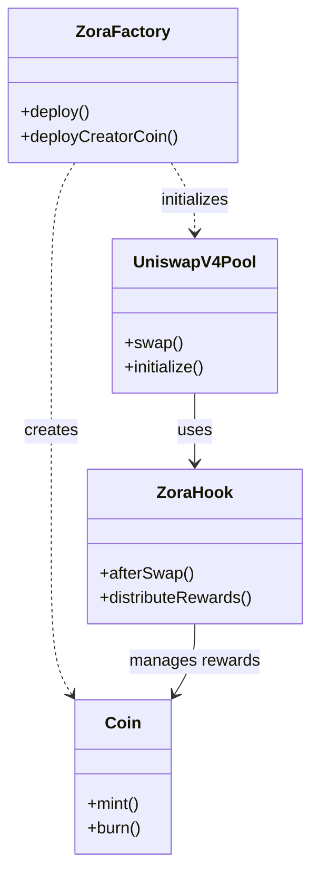

import { ContractAddress } from "@components/ContractAddress";

# Creating a Coin

This guide covers how to create coins directly using the ZoraFactory contract.

## Factory Contract Address

The ZoraFactory is deployed at the same address across all supported chains:

| Chain        | Chain ID | Factory Address                                                                               |
| ------------ | -------- | --------------------------------------------------------------------------------------------- |
| Base         | 8453     | <ContractAddress address="0x777777751622c0d3258f214F9DF38E35BF45baF3" chain="base" />         |
| Base Sepolia | 84532    | <ContractAddress address="0x777777751622c0d3258f214F9DF38E35BF45baF3" chain="base-sepolia" /> |

## Key Components



The **Factory** creates coins and sets up Uniswap V4 pools. The **Hook** automatically manages converting fees to rewards and paying out, plus reminting liquidity on every trade. Each **Coin** is configured to have a primary Uniswap pool with a coin pair of its backing currency. It deposits initial liquidity along multicurve positions to obtain optimized price and curve discovery.

Initial liquidity positions are configured using the [Doppler protocol](https://whetstone.cc/doppler), which provides sophisticated tooling for optimizing Uniswap V4 position strategies and market curves.

## Deployment Methods

### Using the SDK (Recommended)

For most developers, use the [Coins SDK](/coins/sdk/create-coin) which provides a higher-level interface:

- **[`createCoin()`](/coins/sdk/create-coin#basic-creation)** - Main function for creating coins with the SDK
- **[`createCoinCall()`](/coins/sdk/create-coin#using-with-wagmi)** - Lower-level function for WAGMI integration
- **[Metadata Builder](/coins/sdk/metadata-builder)** - Helper for creating valid metadata URIs

### Direct Contract Integration

Use the `deploy` function for new deployments when integrating directly with contracts. This method supports deterministic addressing and post-deployment hooks:

> **Note**: The `msg.sender` that calls the deployment function is considered the creator of the coin.

```solidity
function deploy(
  address payoutRecipient,
  address[] memory owners,
  string memory uri,
  string memory name,
  string memory symbol,
  bytes memory poolConfig,
  address platformReferrer,
  address postDeployHook,
  bytes calldata postDeployHookData,
  bytes32 coinSalt
) external payable returns (address coin, bytes memory postDeployHookDataOut);
```

### Creator Coin Deployment

For Creator Coins specifically, use the `deployCreatorCoin` function:

> **Important**: The `msg.sender` that calls the deployment function is considered the creator. While the protocol technically allows `deployCreatorCoin` to be called multiple times by the same address, the Zora indexer considers only the **first coin created** as the official creator coin for that address.

```solidity
function deployCreatorCoin(
  address payoutRecipient,
  address[] memory owners,
  string memory uri,
  string memory name,
  string memory symbol,
  bytes memory poolConfig,
  address platformReferrer,
  bytes32 coinSalt
) external returns (address);
```

## Parameters

### Required Parameters

- **`payoutRecipient`**: Address that receives creator rewards from trading activity
- **`owners`**: Array of addresses with permission to manage the coin (update metadata, change payout recipient)
- **`uri`**: Metadata URI for the coin (typically an IPFS URL)
- **`name`**: Human-readable name of the coin
- **`symbol`**: Trading symbol for the coin (e.g., "MYCOIN")
- **`poolConfig`**: Encoded configuration determining coin version and pool parameters
- **`platformReferrer`**: Address that receives platform referral rewards (use `address(0)` if none)
- **`coinSalt`**: Salt for deterministic deployment (enables predictable addresses)

### Optional Parameters

- **`postDeployHook`**: Contract address to call after deployment (use `address(0)` if none)
- **`postDeployHookData`**: Data to pass to the post-deployment hook (use empty bytes if none)

## Pool Configuration

The `poolConfig` parameter determines the coin type, pool settings, and market curve characteristics. This configuration defines:

- **Coin version** - Protocol version for backwards compatibility
- **Currency backing** - What token the coin is paired against (ETH, ZORA, or another Creator Coin)
- **Liquidity curves** - Multi-curve position ranges for optimized price discovery
- **Supply distribution** - How initial supply is allocated across liquidity positions

### Recommended Approach

For most use cases, we recommend using our upcoming API endpoints to generate pool configurations. These will provide:

- **Validated configurations** - Pre-tested parameter combinations
- **Optimal curve settings** - Market-tested liquidity distribution strategies
- **Security safeguards** - Protection against parameter manipulation
- **Dynamic updates** - Configurations that evolve with market conditions

### Configuration Types

- **Creator Coins** - ZORA-backed coins with vesting schedules, optimized for creator economies
- **Content Coins** - Flexible backing currency (ETH, ZORA, or Creator Coins), designed for content monetization
- **Custom Configurations** - Specialized setups for advanced use cases

Contact the Zora team for early access to configuration APIs or custom pool parameter consultation.

## Address Prediction

You can predict the coin address before deployment using the `coinAddress` function:

```solidity
function coinAddress(
  address msgSender,
  string memory name,
  string memory symbol,
  bytes memory poolConfig,
  address platformReferrer,
  bytes32 coinSalt
) external view returns (address);
```

This is useful for:

- Preparing integrations before deployment
- Verifying deployment parameters
- Creating deterministic deployment scripts

## Example Deployment

### Complete Deployment Example

```solidity
// SPDX-License-Identifier: MIT
pragma solidity ^0.8.13;

import {IZoraFactory} from "@zoralabs/coins/src/interfaces/IZoraFactory.sol";
import {CoinConfigurationVersions} from "@zoralabs/coins/src/libs/CoinConfigurationVersions.sol";

contract CoinDeployer {
    address constant FACTORY_ADDRESS = 0x777777751622c0d3258f214F9DF38E35BF45baF3;
    address constant NICHE_TOKEN_ADDRESS = 0x5ab1a8dbb78c272540d3652dac9c46d9cbfcecbf;

    function deployMyCoin() external returns (address coin) {
        IZoraFactory factory = IZoraFactory(FACTORY_ADDRESS);

        // Set up coin owners
        address[] memory owners = new address[](1);
        owners[0] = msg.sender;

        // Pool configuration bytes (get from Zora configuration API)
        bytes memory poolConfig = hex"..."; // Replace with actual configuration bytes

        // Generate unique salt for deterministic deployment
        bytes32 salt = keccak256(abi.encodePacked("MyCoin", msg.sender, block.timestamp));

        // Deploy the coin
        (coin, ) = factory.deploy(
            msg.sender,              // payoutRecipient - receives creator rewards
            owners,                  // owners - can update metadata/payout
            "ipfs://your-metadata-hash", // uri - metadata URI
            "My Creator Coin",       // name - full name
            "MYCOIN",                // symbol - trading symbol
            poolConfig,              // poolConfig - pool settings
            address(0),              // platformReferrer - no referrer
            address(0),              // postDeployHook - no post-deploy hook
            "",                      // postDeployHookData - empty
            salt                     // coinSalt - for deterministic address
        );

        return coin;
    }
}
```

## Post-Deployment

After successful deployment, the coin will:

- Be deployed at the predicted address
- Have a Uniswap V4 pool created with the singleton hook
- Be ready for trading immediately
- Begin [distributing rewards on trades automatically](/coins/contracts/rewards)

Learn more about [managing coins](/coins/sdk/update-coin) after deployment.

## Events

The factory emits different events based on the coin type:

### Content Coins

```solidity
event CoinCreatedV4(
  address indexed caller,
  address indexed payoutRecipient,
  address indexed platformReferrer,
  address currency,
  string uri,
  string name,
  string symbol,
  address coin,
  PoolKey poolKey,
  bytes32 poolKeyHash,
  string version
);
```

### Creator Coins

```solidity
event CreatorCoinCreated(
  address indexed caller,
  address indexed payoutRecipient,
  address indexed platformReferrer,
  address currency,
  string uri,
  string name,
  string symbol,
  address coin,
  PoolKey poolKey,
  bytes32 poolKeyHash,
  string version
);
```

### Legacy (V3) Coins

```solidity
event CoinCreated(
  address indexed caller,
  address indexed payoutRecipient,
  address indexed platformReferrer,
  address currency,
  string uri,
  string name,
  string symbol,
  address coin,
  address pool,
  string version
);
```

## Indexing Guidance

- **Why multiple events?**

  - **`CoinCreated` (legacy)**: Emitted by early releases that used Uniswap V3 and returned a pool address.
  - **`CoinCreatedV4`**: Emitted for Content Coins on Uniswap V4 and includes a full `PoolKey` plus `poolKeyHash`.
  - **`CreatorCoinCreated`**: Emitted for Creator Coins on Uniswap V4 and includes the same data shape as `CoinCreatedV4`.

- **Index all coins**: Indexers should listen to all three events to build a complete list of coins across protocol versions.

- **Suggested filter set**

  - Contract: `ZoraFactoryImpl`
  - Events: `CoinCreated`, `CoinCreatedV4`, `CreatorCoinCreated`

- **Field differences**

  - Legacy `CoinCreated` returns a `pool` address (Uniswap V3). V4 events return a `PoolKey` and `poolKeyHash` instead of a pool address (pool address is derived by Uniswap V4).

- **Normalizing into a single record**

  - Use common fields across events: `caller`, `payoutRecipient`, `platformReferrer`, `currency`, `uri`, `name`, `symbol`, `coin`, `version`.
  - For V3: store `poolAddress` from `CoinCreated`.
  - For V4: store `poolKey` (currencies, fee, tickSpacing, hooks), and `poolKeyHash`. If you need the V4 pool address, derive it using the Uniswap V4 formula from `PoolKey`.

- **Creator coin identification**

  - Creator coins are explicitly emitted via `CreatorCoinCreated`.
  - Content coins are emitted via `CoinCreatedV4`.

- **Example (pseudocode)**

```ts
onEvent(evt) {
  switch (evt.name) {
    case 'CoinCreated':
      upsertCoin({
        type: 'legacy',
        coin: evt.args.coin,
        poolAddress: evt.args.pool,
        version: evt.args.version,
        meta: baseFields(evt.args)
      });
      break;
    case 'CoinCreatedV4':
      upsertCoin({
        type: 'content',
        coin: evt.args.coin,
        poolKey: evt.args.poolKey,
        poolKeyHash: evt.args.poolKeyHash,
        version: evt.args.version,
        meta: baseFields(evt.args)
      });
      break;
    case 'CreatorCoinCreated':
      upsertCoin({
        type: 'creator',
        coin: evt.args.coin,
        poolKey: evt.args.poolKey,
        poolKeyHash: evt.args.poolKeyHash,
        version: evt.args.version,
        meta: baseFields(evt.args)
      });
      break;
  }
}
```
