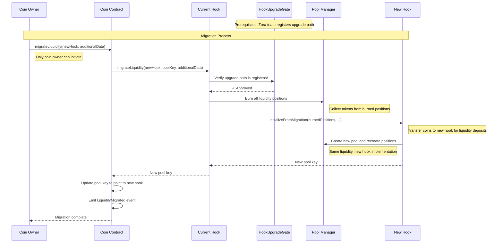

# Liquidity Migration

The liquidity migration system allows users to upgrade their coins to use new hook versions while preserving all existing liquidity positions. Since both coin contracts and [hooks are immutable smart contracts](/coins/contracts/hook) that cannot be modified once deployed, this migration system enables users to benefit from bug fixes and improvements released by Zora without having to create entirely new coins.

## Overview

Both coin contracts and hook contracts are immutable once deployed - they cannot be upgraded or modified. This immutability provides security guarantees but means that improvements, bug fixes, and new features cannot be added to the existing contracts.

Liquidity migration gives users control to upgrade their hook logic to access new functionality and improvements. Only coin owners can initiate migrations, and as a security measure, upgrades can only be performed to hooks in registered upgrade paths that have been approved by the Zora team.

When a coin migrates from one hook to another, all liquidity positions from the initial market liquidity created on coin initialization are burned and reminted in the new hook, preserving the same liquidity positions as before.

This migration system works for both Content Coins and Creator Coins, allowing any coin owner to upgrade their hook implementation.

## How It Works

The migration process is initiated by the coin creator and involves interactions between multiple contracts:



## Events

When a migration is successful, the coin contract emits a `LiquidityMigrated` event:

```solidity
event LiquidityMigrated(
    PoolKey oldPoolKey,
    bytes32 indexed oldPoolKeyHash,
    PoolKey newPoolKey,
    bytes32 indexed newPoolKeyHash
);
```