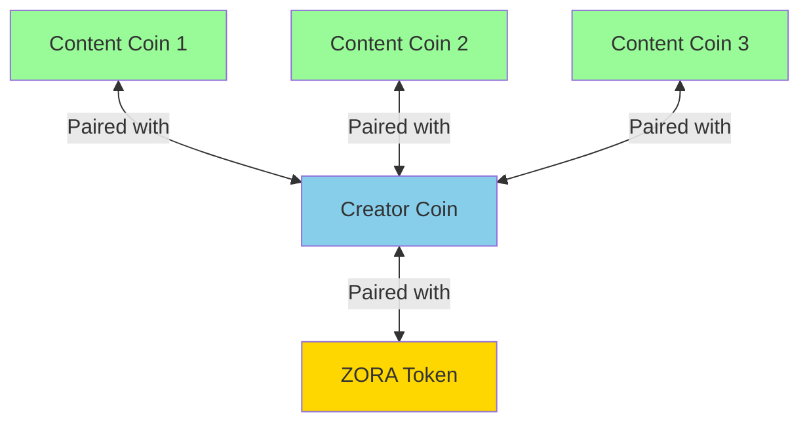
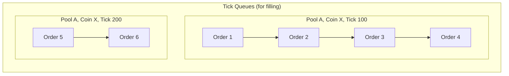
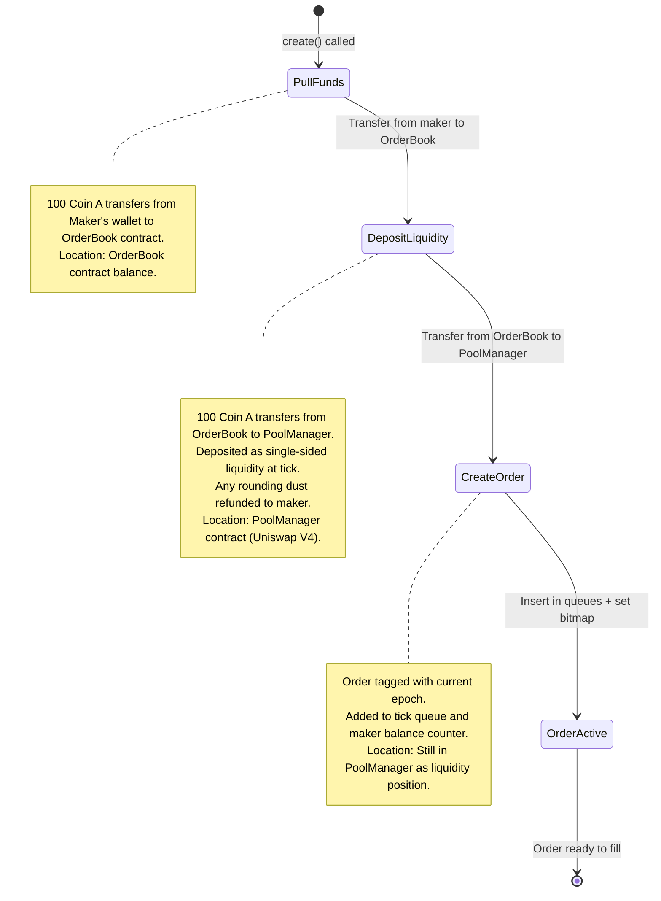
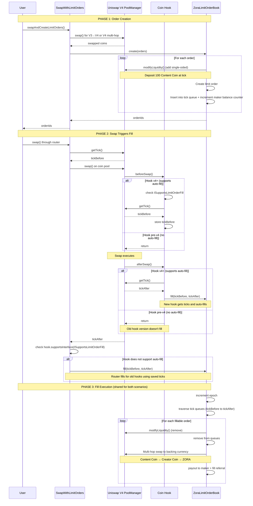
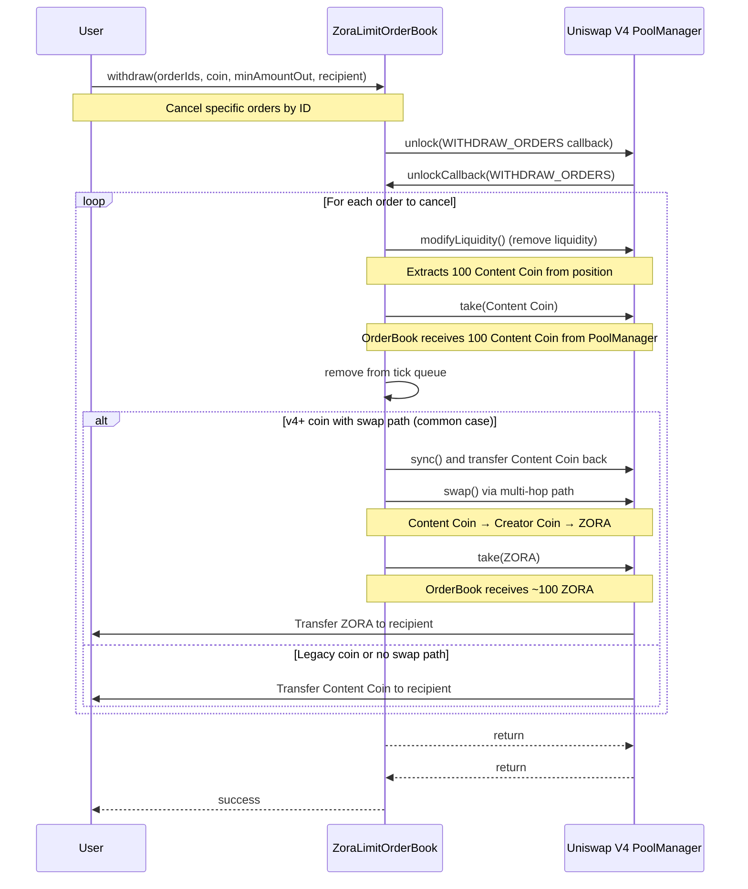
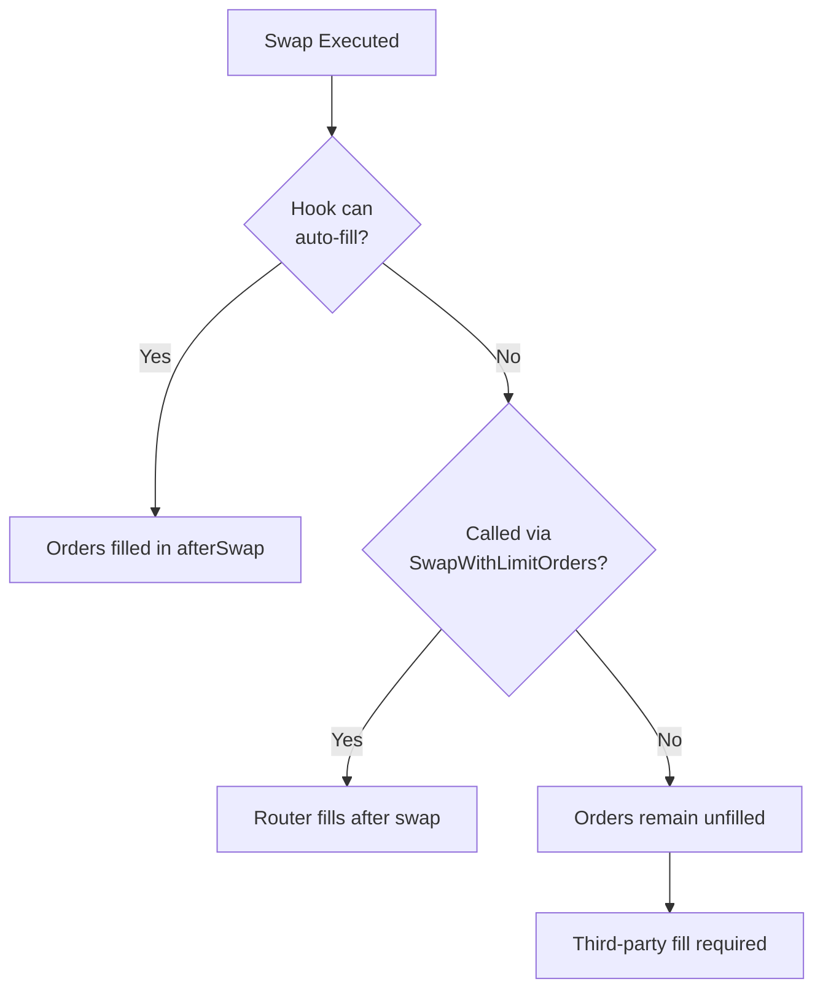
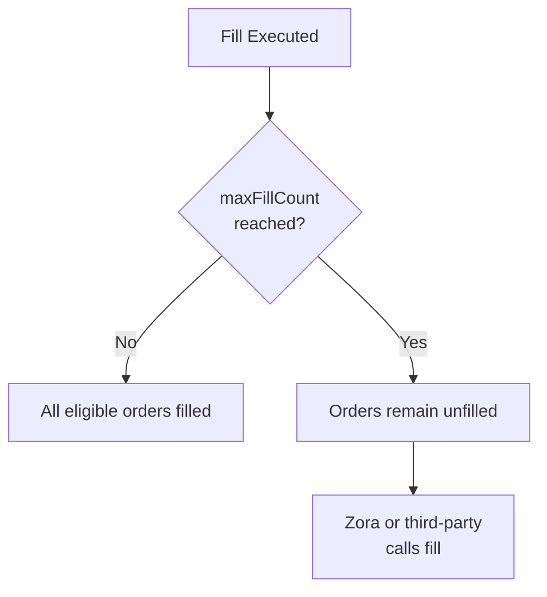
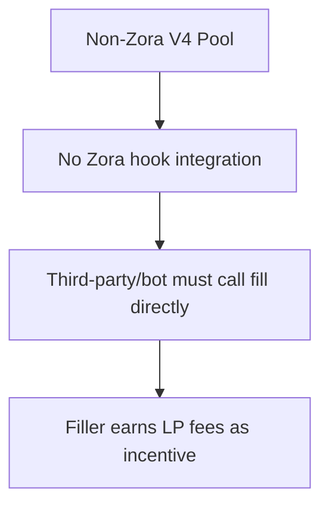

# Zora Limit Order Book Protocol

### Quick Start (Auditors & Integrators)

- **Architecture + diagrams (this doc)**: [`README.md`](./README.md)
- **Normative behavior + invariants**: [`SPEC.md`](./SPEC.md)
- **Threat model + audit checklist**: [`AUDIT_NOTES.md`](./AUDIT_NOTES.md)
- **Audit scope / process**: [`AUDIT_RFP.md`](./AUDIT_RFP.md)

If you’re auditing: read **README → SPEC → AUDIT_NOTES → code**.

### Table of Contents

- [1. Overview](#1-overview)
- [2. Coins Platform Architecture](#2-coins-platform-architecture)
- [3. Limit Orders Architecture Overview](#3-limit-orders-architecture-overview)
- [4. Fill Execution Paths](#4-fill-execution-paths)
- [5. Security Model & Guarantees](#5-security-model--guarantees)
- [6. Gas Limits & DOS Prevention](#6-gas-limits--dos-prevention)

### 1. Overview

The Zora Limit Order Book is an on-chain limit order system for Zora Coins integrated with Uniswap V4. Orders are created by depositing single-sided liquidity on a pool at specific price points (ticks).

**Key Capabilities**

- **Create orders** - Deposit coins as single-sided liquidity at target price ticks
- **Fill orders** - Automatically fill orders when swaps cross their price points
- **Withdraw orders** - Cancel unfilled orders and retrieve deposited coins

**Automatic Filling**

Orders are automatically filled by the hook on each swap when possible. If there are many outstanding orders to fill, some will remain unfilled. Third parties can fill these remaining orders and collect the LP fees from the positions they fill as an incentive.

### 2. Coins Platform Architecture

For a comprehensive understanding of the Zora Coins protocol, see the [Contract Architecture documentation](../../docs/pages/coins/contracts/architecture.mdx).

#### Quick Summary

The Zora Coins platform consists of.

Coin Types

- **Creator Coins**: Backed by ZORA token, one per creator
- **Content Coins**: Backed by creator coin (or any coin), multiple per creator

Core Components

- **ZoraFactoryImpl**: Deploys coins with deterministic addresses
- BaseCoinV4: Base implementation for all coins
- ZoraV4CoinHook: Unified hook for all coins (handles fee collection and reward distribution)
- Uniswap V4 PoolManager: Manages liquidity pools and swap execution

Coin Pairing Structure.



Key Relationships.

- Content coins trade against creator coins (many-to-one relationship)
- Creator coins trade against ZORA token (many-to-one relationship)
- Each pool is a Uniswap V4 liquidity pool with concentrated liquidity
- All coins use the same hook contract (unified implementation since v2.3.0)
- Hook is immutable and tied to factory version
- When factory upgrades, new coins use new hook, but existing coins remain on old hook

Hook Versioning.

- Factory can be upgraded to point to new hook version
- New coins deployed with new factory use new hook
- Existing coins can migrate liquidity to new hook via `migrateLiquidity()`
- Migration changes pool identity (new poolKeyHash)

Impact on Limit Orders.

- Limit orders are tied to specific pool (via poolKeyHash)
- When coin migrates to new hook, orders remain on old pool
- Coins on old hooks won't auto-fill orders (no `ISupportsLimitOrderFill` in hook)
- SwapWithLimitOrders router provides filling for legacy coins

### 3. Limit Orders Architecture Overview

#### Main Components

The Zora Limit Orders system consists of three primary components.

1. ZoraLimitOrderBook (Core Contract)

Location: [`src/ZoraLimitOrderBook.sol`](./src/ZoraLimitOrderBook.sol)

The main contract that manages the entire limit order lifecycle. It handles.

- Order creation with single-sided liquidity deposits
- Order filling through Uniswap V4 liquidity removal
- Order withdrawal and cancellation
- Balance management for makers
- Integration with Uniswap V4 PoolManager via unlock/callback pattern

All state-changing operations go through the `poolManager.unlock()` pattern, with callbacks handling the actual logic.

2. SwapWithLimitOrders Router

Location: [`src/router/SwapWithLimitOrders.sol`](./src/router/SwapWithLimitOrders.sol)

A specialized router that combines multi-hop swaps with limit order creation and filling.

Features

- Executes V3→V4 multi-hop swaps
- Executes V4 multi-hop swaps
- Automatically creates limit orders after swaps (order ladders)
- Fills orders on legacy coins (coins without `ISupportsLimitOrderFill` support)
- Handles ETH wrapping and unwrapping

This router is critical for.

- Users who want to swap and immediately place limit orders
- Filling orders on coins using old hooks that don't support auto-fill

3. Library System

The contract uses libraries to make logic more portable.

Components

- [`LimitOrderCreate.sol`](./src/libs/LimitOrderCreate.sol) - Order creation and validation logic
- [`LimitOrderFill.sol`](./src/libs/LimitOrderFill.sol) - Order filling and epoch management
- [`LimitOrderWithdraw.sol`](./src/libs/LimitOrderWithdraw.sol) - Order cancellation and balance withdrawal
- [`LimitOrderLiquidity.sol`](./src/libs/LimitOrderLiquidity.sol) - Uniswap V4 liquidity position management
- [`LimitOrderQueues.sol`](./src/libs/LimitOrderQueues.sol) - Linked-list queue operations
- [`LimitOrderBitmap.sol`](./src/libs/LimitOrderBitmap.sol) - Tick bitmap for efficient order discovery
- [`LimitOrderStorage.sol`](./src/libs/LimitOrderStorage.sol) - Diamond storage pattern implementation
- [`LimitOrderCommon.sol`](./src/libs/LimitOrderCommon.sol) - Common utilities and order metadata helpers
- [`SwapLimitOrders.sol`](./src/libs/SwapLimitOrders.sol) - Order ladder configuration and validation
- [`Permit2Payments.sol`](./src/libs/Permit2Payments.sol) - Permit2 token transfer support

4. Access Control

- [`SimpleAccessManaged.sol`](./src/access/SimpleAccessManaged.sol) - Base contract for access-controlled functions
- [`SimpleAccessManager.sol`](./src/access/SimpleAccessManager.sol) - Role-based access manager implementation

#### Tick Queue System

Orders are organized in tick-based queues for efficient filling during swaps.

**Tick Queue**: Orders indexed by `(poolKeyHash, coin, tick)` tuple

- Allows efficient discovery of fillable orders at specific price points
- Used during fill operations to find orders in price range
- Orders within each tick are processed FIFO (first in, first out)

Queue and Order Structures

```solidity
struct Queue {
  bytes32 head; // First order in queue
  bytes32 tail; // Last order in queue
  uint128 length; // Number of orders
  uint128 balance; // Total liquidity at this tick
}

struct LimitOrder {
  // Linked-list pointers
  bytes32 nextId; // Next order in tick queue
  bytes32 prevId; // Previous order in tick queue
  // Pool binding
  bytes32 poolKeyHash;
  // Amounts
  uint128 orderSize;
  uint128 liquidity;
  // Order metadata
  int24 tickLower;
  int24 tickUpper;
  uint32 createdEpoch;
  OrderStatus status;
  bool isCurrency0;
  address maker;
}
```

The tick queue system provides several benefits

- O(1) insertion and removal when order ID is known
- Efficient iteration over orders at specific tick
- Maintains FIFO ordering for fair filling - orders at the same tick are filled in the order they were created

Each limit order contains the following fields

| Field          | Type        | Purpose                                                                        |
| -------------- | ----------- | ------------------------------------------------------------------------------ |
| `nextId`       | bytes32     | Next order in the tick queue                                                   |
| `prevId`       | bytes32     | Previous order in the tick queue                                               |
| `poolKeyHash`  | bytes32     | Identifies which pool this order belongs to (hash of PoolKey)                  |
| `orderSize`    | uint128     | Amount of tokens deposited by maker (for refunds/accounting)                   |
| `liquidity`    | uint128     | Actual Uniswap V4 liquidity amount (may differ from orderSize due to rounding) |
| `tickLower`    | int24       | Lower tick of the liquidity position                                           |
| `tickUpper`    | int24       | Upper tick of the liquidity position (tickLower + tickSpacing for sell orders) |
| `createdEpoch` | uint32      | Epoch when order was created (used for fill protection)                        |
| `status`       | OrderStatus | Current state: INACTIVE (withdrawn), OPEN (active), FILLED (executed)          |
| `isCurrency0`  | bool        | Direction: true = selling currency0, false = selling currency1                 |
| `maker`        | address     | Address that created the order and will receive proceeds                       |

Queue Structure Visualization

Here's how orders are organized in tick queues.



Queue Data Structures

Each tick queue is a doubly-linked list that maintains order information.

- Key: `poolKeyHash → coin → tick → Queue`
- Contains: head pointer, tail pointer, balance (total order size at tick), length (order count)
- Orders within a tick are processed head-to-tail (first in, first out)

**Maker Balances**: A separate `makerBalances[maker][coin]` mapping tracks total order size per maker for `balanceOf()` queries. This is a simple counter, not a queue structure.

Tick Discovery (Bitmap Implementation)

To efficiently find which ticks have active orders without iterating over empty ticks, the system uses a tick bitmap.

```solidity
// Bitmap tracking which ticks have orders
mapping(int16 => uint256) tickBitmap;

// Set bit when first order added to tick
// Clear bit when last order removed from tick
```

This bitmap allows O(1) lookup to find the next tick with orders during fills, avoiding iteration over thousands of empty tick positions.

#### Component Interaction Flows

#### Order Creation Flow

Users create limit orders through the SwapWithLimitOrders router, which combines swapping with order placement.

Order Creation State Flow



Order Creation and Filling Flow



#### Withdrawal Flow

Users can cancel orders and withdraw funds at any time.

**`withdraw(orderIds, coin, minAmountOut, recipient)`** - Cancel specific orders by ID

- `orderIds`: Array of order IDs to cancel
- `coin`: The coin address for these orders
- `minAmountOut`: Minimum amount to receive (reverts if not met)
- `recipient`: Address to receive the withdrawn funds

Notes:

- Orders are cancelled in the order provided in `orderIds` until `minAmountOut` is reached.
- Cancellation is whole-order only (no proportional/partial cancellation).



#### Key Architectural Decisions

Single-Sided Liquidity

Orders are created by depositing one side of a liquidity position at a specific tick range. This implements Uniswap's [range orders concept](https://docs.uniswap.org/concepts/protocol/range-orders).

- Sell orders: Deposit coin, receive backing currency (e.g., content coin → creator coin)
- Buy orders: Deposit backing currency, receive coin

This leverages Uniswap V4's concentrated liquidity to ensure orders fill at exact prices.

Epoch-Based Protection

Each pool has an epoch counter that increments on every fill operation. Orders store their creation epoch and can only be filled in future epochs. This prevents same-transaction manipulation attacks.

Diamond Storage Pattern

All state is stored in a single struct at a deterministic storage slot.

```solidity
bytes32 constant STORAGE_SLOT = keccak256("zora.limit.order.book.storage");
```

This enables.

- Clean separation of storage from logic
- Potential future upgradeability
- Gas-efficient storage access

Access Control via SimpleAccessManaged

Uses OpenZeppelin's access control pattern with a separate `AccessManager` contract.

- Flexible role-based permissions
- Can restrict `create()` to specific routers/hooks if needed
- Authority can be transferred or upgraded

### 4. Fill Execution Paths

Orders can be filled through three distinct paths depending on whether the hook supports auto-fill and how swaps are executed.



**Path 1: Auto-Fill (Hook)** - [`ZoraV4CoinHook.sol`](../coins/src/hooks/ZoraV4CoinHook.sol)

Triggered automatically on every swap (whether via Zora router or directly on Uniswap) for coins using hooks that support auto-fill. The hook captures the tick before and after the swap, then calls `fill()` in `afterSwap`. No external action required - orders fill seamlessly during normal trading.

**Path 2: Router Fill** - [`SwapWithLimitOrders.sol:410-428`](./src/router/SwapWithLimitOrders.sol)

For coins on hooks that don't support auto-fill. The SwapWithLimitOrders router detects this and calls `fill()` after the swap completes. This is the fallback mechanism when swaps go through the Zora router.

**Path 3: Third-Party Fill** - [`ZoraLimitOrderBook.sol:81-138`](./src/ZoraLimitOrderBook.sol)

Direct calls to `fill()` by Zora backend, arbitrage bots, or other third parties. Required when:

- Swaps bypass the Zora router on hooks that don't support auto-fill
- `maxFillCount` is reached during auto-fill or router fill, leaving orders unfilled

Supports both range-based fills (by tick range) and order-specific fills (by order IDs). Fillers are incentivized by collecting LP fees from filled positions.



#### Hook Migration & Fill Path Dependencies

**Auto-Fill Requires Hook Support**

For a coin to benefit from automatic order filling via Path 1, the coin must use a hook that supports auto-fill. Some coins may be on older hooks that don't have this capability.

**Fallback Scenarios**

| Scenario                                                      | Fill Path Used            |
| ------------------------------------------------------------- | ------------------------- |
| Hook supports auto-fill + swap via any method                 | Auto-Fill (Hook)          |
| Hook doesn't support auto-fill + swap via SwapWithLimitOrders | Router Fill               |
| Hook doesn't support auto-fill + direct Uniswap swap          | Third-Party Fill required |
| Any hook + maxFillCount reached                               | Third-Party Fill required |

**Direct Uniswap Swaps (Bypassing Zora Router)**

When users swap directly on Uniswap without using the SwapWithLimitOrders router:

- If hook supports auto-fill: Orders auto-fill via hook
- If hook doesn't support auto-fill: **Orders will NOT auto-fill** - relies on:
  - Zora backend monitoring and filling orders
  - Third-party arbitrageurs/bots filling for profit
  - Manual fill calls

This is an important consideration for coins on older hooks - their order filling depends on external actors when swaps bypass the Zora router.

#### Universal Uniswap V4 Compatibility

**Not Restricted to Zora Coins**

The ZoraLimitOrderBook is designed to work with **any Uniswap V4 pool**, not just Zora coins. Third parties can use this order book for any V4 token pair.

**For Non-Zora V4 Pools**

| Operation       | How It Works                                                       |
| --------------- | ------------------------------------------------------------------ |
| Create Orders   | Call `create()` with any valid V4 PoolKey (requires create access) |
| Fill Orders     | Call `fill()` directly - no hook integration needed                |
| Withdraw Orders | Call `withdraw()` - always available to maker                      |



**Key Differences for Non-Zora Pools:**

- No auto-fill from hook (hook must implement `ISupportsLimitOrderFill` and call the order book)
- No router fill (SwapWithLimitOrders is designed for Zora coin swap paths)
- Orders rely entirely on third-party fillers or direct `fill()` calls
- Fillers are incentivized by collecting LP fees from filled positions

**Integration Path for Other Protocols**

Other protocols can integrate limit order filling by:

1. Implementing `ISupportsLimitOrderFill` in their hook
2. Calling `limitOrderBook.fill()` in their `afterSwap` hook
3. Registering their hook with the Zora hook registry (for unlocked fill access)

This makes the order book a general-purpose infrastructure component that can serve the broader Uniswap V4 ecosystem.

### 5. Security Model & Guarantees

#### Protocol Concerns

1. **Fund Safety**: Users can ALWAYS withdraw via `withdraw()` - no admin lock possible
2. **Trading Continuity**: No pause mechanism exists that can block coin swaps
3. **DOS Prevention**: `maxFillCount` limits orders per fill operation
4. **Admin Boundaries**: Admin cannot touch user funds or block withdrawals

#### Actor Analysis

| Actor        | Can Impact Others? | Protections                                                                |
| ------------ | ------------------ | -------------------------------------------------------------------------- |
| Order Makers | No                 | Orders isolated in per-tick queues + maker balances are tracked separately |
| Fillers      | No                 | Bad fill attempts don't affect other users                                 |
| Admin        | Limited            | Can adjust maxFillCount but cannot lock funds                              |

#### Admin Capabilities

**Admin CAN:**

- Restrict `create()` access via authority contract
- Set `maxFillCount` to limit orders per fill operation
- Change the authority contract

**Admin CANNOT:**

- Withdraw user funds
- Block withdrawals
- Force fills
- Pause the system

#### Why `create()` is Access Controlled

The `create()` function is restricted to authorized callers for operational safety:

1. **Bad Order Detection**: If malicious actors insert pathological orders designed to grief fills or game the system, admin can revoke their access without affecting other users

2. **Contract Upgradability**: The SwapWithLimitOrders router may need additional validation in the future. By controlling access:

   - Admin can disable the current router's create access
   - Deploy a new router version with improved validation
   - Grant create access to the new router
   - No contract upgrade or user migration required

3. **Gradual Rollout**: New integrations can be added incrementally by granting create access to vetted contracts

This design allows the limit order system to evolve without requiring upgrades to the core ZoraLimitOrderBook contract, while maintaining user fund safety (withdrawals always work regardless of create restrictions).

### 6. Gas Limits & DOS Prevention

#### maxFillCount Parameter

The `maxFillCount` parameter limits how many orders can be processed in a single fill operation:

- Prevents unbounded gas consumption during fills
- Default: 50 orders (configurable by admin)
- If more orders exist than `maxFillCount`, remaining orders are filled in subsequent calls

#### Gas Analysis from Testing

| Orders | Block Utilization | Safety Margin | Recommendation |
| ------ | ----------------- | ------------- | -------------- |
| 25     | ~25%              | 4×            | Conservative   |
| 40     | ~37%              | 2.7×          | Recommended    |
| 50     | ~43%              | 2.3×          | Aggressive     |

#### Fusaka/Future Hard Fork Considerations

- `maxFillCount` can be reduced if gas costs change in future hard forks
- Admin adjustment doesn't require contract upgrade
- Multiple fill calls handle orders beyond `maxFillCount`
- System designed to remain functional even with significant gas repricing

#### Admin DOS Risk

- Setting the stored `maxFillCount` to `0` disables fills only when callers pass `maxFillCount=0` (i.e. request the stored default). Callers can still pass a non-zero `maxFillCount` to execute range fills.
- Mitigation: Use multisig/timelock for admin authority
- User funds remain safe - only auto-fill would be affected
- Users can always withdraw their orders regardless of fill settings
