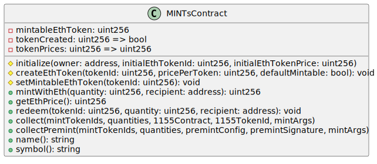
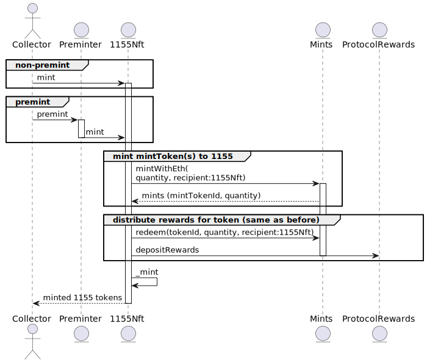
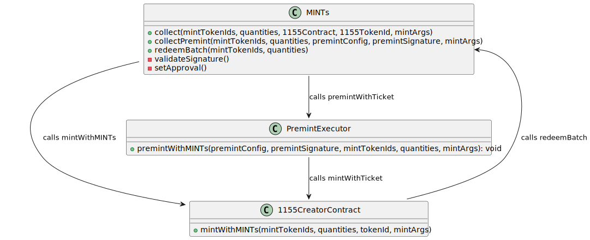

## Zora MINTs Contract

The Zora MINTs contract is an ERC-1155 contract that allows for the minting and
collecting of Zora Creator ERC-1155 NFTs using MINTs.

MINTs are ERC-1155s, with each token ID having a fixed value in ETH that can be
minted at that ETH value. The owner of a MINT can either redeem it or use it to
collect a Zora Creator ERC-1155 NFT. When it is used to collect a Zora Creator
ERC-1155 NFT, the MINT is burned and the underlying value is distributed to a
set of recipients in the form of fees and rewards, with the percentage split
configured in the creator contract. When a MINT is redeemed, the underlying
value is distributed to a desired recipient, and the MINT is burned. A single
MINT token ID is configured to be mintable; this is the only token ID that can
be minted at the current time, and it defines the current price in ETH to
purchase a MINT.

*Class Diagram of the MINTs contract*

The MINTs contract is deployed determinstically to the same address on all chains, at address [0x77777773dE7607C8d2eF571ba03ab22a7df64CEA](https://sepolia.explorer.zora.energy/address/0x77777773dE7607C8d2eF571ba03ab22a7df64CEA)

## Transparent Minting of Zora Creator 1155 Tokens with ETH

When a collector mints a Zora Creator 1155 NFT, they can mint it with ETH, and
the underlying value is minted in MINT at the ETH price of the current mintable
token ID, with the recipient being the 1155 contract; the 1155 contract then
redeems the MINTs, unwrapping their value while distributing the value in the
form of rewards and fees.

A transaction of creating a premint like this can be seen [here](https://sepolia.explorer.zora.energy/tx/0x2e10cbd78418c1cfd7edb34ab45b5ac71c703e539f2e92943759b8618ca7b010)

## Using MINT to collect erc1155 nfts

MINT can be used to collect Zora erc1155 creator nfts, by calling specialized functions
`collect` and `collectPremint` for collecting onchain and premint (gasless) creator 1155s correspondingly.  These functions must be called by owners of MINTs and are passed in MINT token ids and quantities of each to use, and a target erc1155 contract and token id, or premint config and signature in the case of premint.   The combination of token ids and quantities to use are up to the caller of the functions, but they should be preferred to be the tokens of the least value so that the least amount of value is used by the collector to collect the desired erc1155 nft.  No matter the underlying value, one MINT token id can be used to collect one erc1155 nft.  Additional eth must be sent with the function call to account for the price of paid mints.

## Deployment and Upgradability

The MINT contract is deployed deterministically to the same address on all
chains it is supported on. The address is configured in the
[mints-deployments](../mints-deployments) package.

The [TransparentUpgradeableProxy](https://docs.openzeppelin.com/contracts/5.x/api/proxy#TransparentUpgradeableProxy)
is chosen as the upgradability mechanism for this contract, because it ensures
that the upgrade function is immutable and can never be accidentally broken.