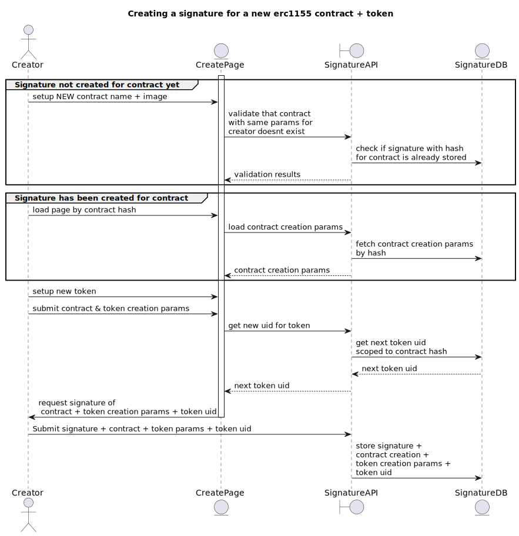
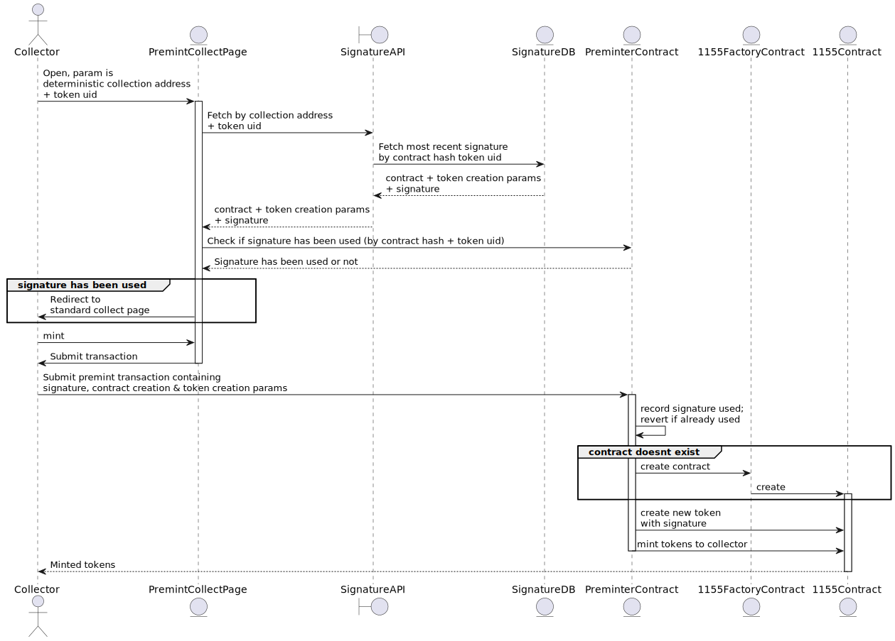

# Preminter

## Design

A Preminter contract validates signatures and executes actions to 1. deploy contracts, 2. create tokens, 3. setup created token parameters 
4. mint tokens to the executor of the transaction as a reward. 

## Design

- General goal: Create a contract (”SignedExecutor”) that validates signatures and executes actions to 1. deploy contracts, 2. create tokens, 3. setup created token parameters 4. mint tokens to the executor of the transaction as a reward
- A creator can create multiple tokens without needing to pay any gas.  Each token creation intent is bundled into a signature, which can be executed later by any account.  The signature for each token are unordered; they can be executed in any order, and the order they are executed on will determine their token id.
## Contracts

`Preminter`: Executes commands on the 1155 contract factory, and created 1155 contracts

Constraints:
  * **Contract creation params must be unique**  - the combination of creator + metadata uri + name must be unique.   The Preminter can only create a single contract for each combination of creator, metadat uri, and name, as that combination is used to determinstically determine the contract address.  

Functions:
  * `premint`: takes an [EIP712 signature](https://eips.ethereum.org/EIPS/eip-712) created by a creator, contract and token creation params, and creates a contract if the contract doesn’t exist and creates a new token, or creates a new token on an existing contract if it exists.  It then mints a specified quantity of tokens to the executor as a reward.   These parameters are the same both if a new contract is created or a token is created on an existing contract.  The signature must have been previously created from a hash built from all of the input parameters; the hash can be generated using `premintHashData`.  **Each signature can only be executed against once**; this is enforced through uniqueness of the contract creation params, the token creation params, and quantity to mint.
    * inputs:
      * `contractCreationConfig`
        * `contractAdmin` - creator/admin of the contract.  **Must match the address of the account that signed the signature**
        * `contractURI` - metadata uri of the contract
        * `defaultRoyaltyConfiguration` - contract royalty config
      * `tokenCreationConfig`
        * `tokenURI` - metadata uri of the token to be created
        * `tokenMaxSupply` - max supply of the token to be created
        * `saleDuration` - how long this token should be on sale for, from the time of the first mint.  If 0, duration is infinite
        * `maxTokensPerAddress` - max tokens an address can mint
        * `pricePerToken` - cost to mint each token
        * `uid` - unique id of the token scoped within the contract.  Ensures that multiple signatures for a token cannot be executed thus creating two tokens. 
      * `signature` - signature signed message containing all of the above parameters
      * `quantityToMint` - how many of the initial tokens to mint to the executor

## Functional flow:

### Diagrams

Creating a new contract + token:

Collecting:

## Additional caveats

* The `Preminter` contract is granted the role `PERMISSION_BIT_MINTER` on the 1155 contract, allowing it to create new tokens. 
* There are some issues where marketplaces show tx.origin of a transaction as the contract creator, which in this case would show the collector as the contract creator.