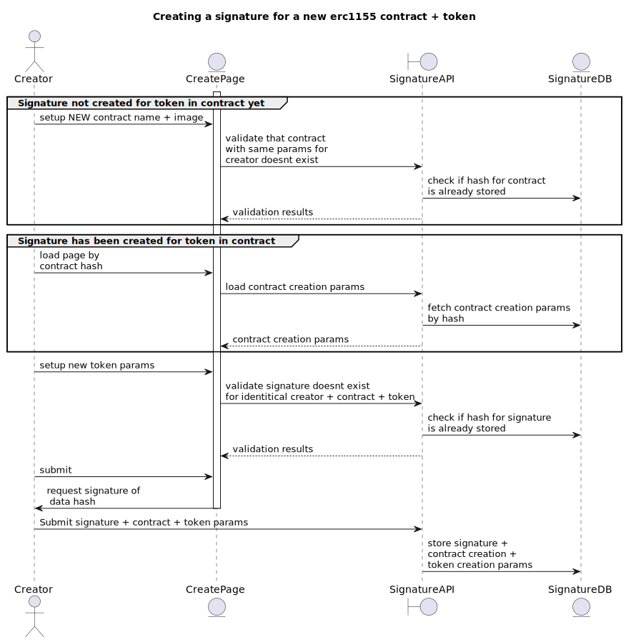
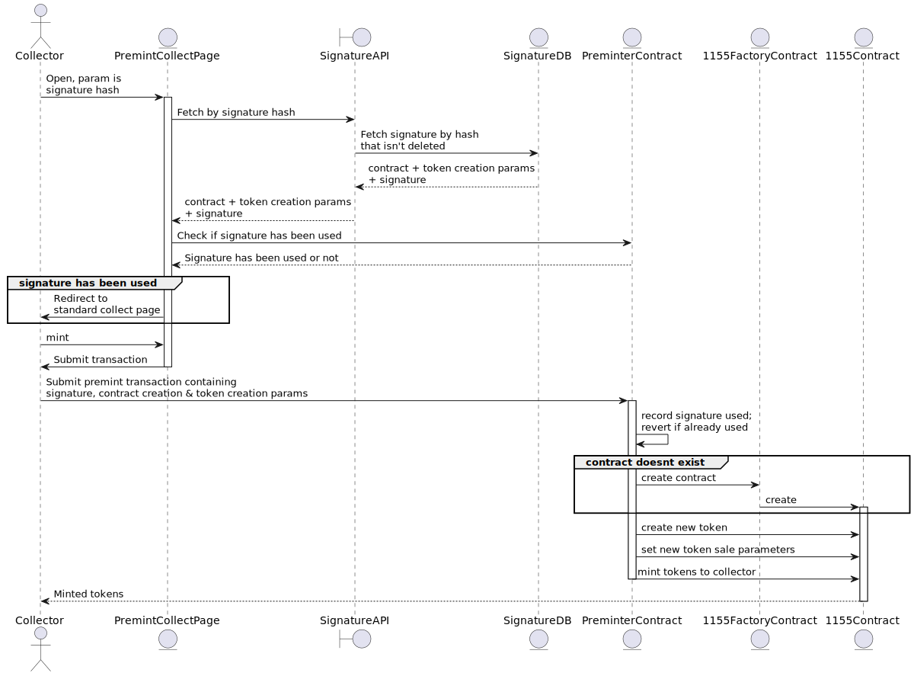

# Preminter

## Design

A Preminter contract validates signatures and executes actions to 1. deploy contracts, 2. create tokens, 3. setup created token parameters 
4. mint tokens to the executor of the transaction as a reward. 

## Design

- General goal: Create a contract (”SignedExecutor”) that validates signatures and executes actions to 1. deploy contracts, 2. create tokens, 3. setup created token parameters 4. mint tokens to the executor of the transaction as a reward
- A creator can create multiple tokens without needing to pay any gas.  Each token creation intent is bundled into a signature, which can be executed later by any account.  The signature for each token are unordered; they can be executed in any order, and the order they are executed on will determine their token id.
## Contracts

`Preminter`: Executes commands on the 1155 contract factory, and created 1155 contracts

Constraints:
  * **Contract creation params must be unique**  - the combination of creator + metadata uri + name must be unique.   The Preminter can only create a single contract for each combination of creator, metadat uri, and name.  There must be some sort of validation in the create flow that ensures a contract has not been created with those parameters.
  * **For each contract, token parameters must be unique.** The combination of parameters for the token to be created, including metadata uri, max supply, duration, etc **must be unique within each contract.**  i.e. a contract cannot have two tokens with the same parameters.  This is because we use this combination to ensure that a signature to create the token can only be executed once.  An alternative design is to require a unique nonce to be appended to the parameters, which would ensure uniqueness; this would need to be provided by the backend.

Functions:
  * `premint`: takes an [EIP712 signature](https://eips.ethereum.org/EIPS/eip-712) created by a creator, contract and token creation params, and creates a contract if the contract doesn’t exist and creates a new token, or creates a new token on an existing contract if it exists.  It then mints a specified quantity of tokens to the executor as a reward.   These parameters are the same both if a new contract is created or a token is created on an existing contract.  The signature must have been previously created from a hash built from all of the input parameters; the hash can be generated using `premintHashData`.  **Each signature can only be executed against once**; this is enforced through uniqueness of the contract creation params, the token creation params, and quantity to mint.
    * inputs:
      * `contractAdmin` - creator/admin of the contract.  **Must match the address of the account that signed the signature**
      * `contractURI` - metadata uri of the contract
      * `defaultRoyaltyConfiguration` - contract royalty config
      * `tokenURI` - metadata uri of the token to be created
      * `tokenMaxSupply` - max supply of the token to be created
      * `saleDuration` - how long this token should be on sale for, from the time of the first mint.  If 0, duration is infinite
      * `maxTokensPerAddress` - max tokens an address can mint
      * `pricePerToken` - cost to mint each token
      * `quantityToMint` - how many of the initial tokens to mint to the executor as their reward
      * `signature` - signature  - signed message encoding all of the above parameters
  * `premintHashData` - read only function that takes premint parameters, and generates a hash which is used to create a signature.
      * inputs (see `premint` description for parameter descriptions.  These parameters are all the same as `premint` - without the `signature` as input):
        * `contractAdmin`
        * `contractURI`
        * `defaultRoyaltyConfiguration`
        * `tokenURI`
        * `tokenMaxSupply` - max supply of the token to be created
        * `saleDuration` - how long this token should be on sale for, from the time of the first mint.  If 0, duration is infinite
        * `maxTokensPerAddress` - max tokens an address can mint
        * `pricePerToken` - cost to mint each token
        * `quantityToMint` - how many of the initial tokens to mint to the executor as their reward
      * Returns - a `bytes32` hash that is signed using the creator’s account to create a `signature`
  * `premintIds` - read only function that takes the premint parameters, and gets unique hashes that act as unique ids for the contract and token.  Same logic is used in the contract to ensure uniqueniess of contracts and ids. 
    * inputs: same as `premint`
    * Returns - two `uint256` values, one for the contract id, and one for the token id.

## Functional flow:

### Diagrams

Creation:

Collecting:

* In the front-end a creator creates a signature for a contract and token creation, and quantity of tokens to mint to the executor.  The signature is created off-chain by the creator's account on a hash of the above said parameters. The hash is created using the read-only contract function `premintHashData`, which returns a `bytes32`.  It there are additional tokens to be created, hashes and signatures are created for each token creation. There must be some validation that a signature with the same parameters has not already been created (see constraints above).  This can be done by checking against the uniqueness of the created signature.
* Once the creator has signed the message, a backend service (another db or blockchain) must store these signatures which can be retreived later by a collector.  This backend must store both the contract creation parameters and the signature.  Basically all of the inputs to the function `premint`. 
* A collector lands on a page that loads the signature and contract creation params based on the bytes32 signature.  The contract creation parameters and signature are loaded from the backend service or a subgraph which loads the previously stored signature.
* The collector account executs the function `premint`, passing the corresponding signature and contract creation params.  If the contract has not been created, it is created.  A a new token is created on that contract, and `quantityToMint` tokens are minted to the executor.

## Additional caveats

* The `Preminter` contract is granted the role `PERMISSION_BIT_MINTER` on the 1155 contract, allowing it to create new tokens. 
* There are some issues where marketplaces show tx.origin of a transaction as the contract creator, which in this case would show the collector as the contract creator.